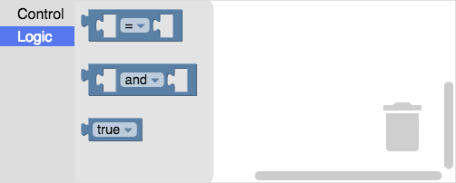
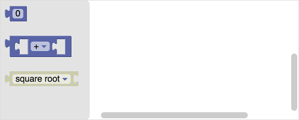

# 工具箱
工具箱是用户可以创建新块的侧边菜单。工具箱的结构使用XML指定，XML可以是节点树，也可以是字符串表示。
将此XML注入到页面中时，会将其传递给Blockly。如果您不想手动输入XML，我们建议您查看[Blockly Developer Tools](https://developers.google.cn/blockly/guides/create-custom-blocks/blockly-developer-tools)。有了它，您可以构建一个工具箱并使用可视化界面自动生成其工具箱XML。

这是一个使用节点树的最小示例：
```XML
<xml id="toolbox" style="display: none">
  <block type="controls_if"></block>
  <block type="controls_whileUntil"></block>
</xml>
<script>
  var workspace = Blockly.inject('blocklyDiv',
      {toolbox: document.getElementById('toolbox')});
</script>
```
以下是使用字符串表示的相同示例：
```HTML
<script>
  var toolbox = '<xml>';
  toolbox += '  <block type="controls_if"></block>';
  toolbox += '  <block type="controls_whileUntil"></block>';
  toolbox += '</xml>';
  var workspace = Blockly.inject('blocklyDiv', {toolbox: toolbox});
</script>
```
以上两者都创建了具有两个块的相同工具箱：


如果存在少量块，则可以显示它们而没有任何类别（如上面的最小示例中所示）。在此简单模式下，所有可用块都显示在工具箱中，主工作区上没有滚动条，并且不需要垃圾桶。

## 分类

工具箱中的块可以按类别组织。这里有两个类别（'Control'和'Logic'），每个类别包含三个块：
```XML
<xml id="toolbox" style="display: none">
  <category name="Control">
    <block type="controls_if"></block>
    <block type="controls_whileUntil"></block>
    <block type="controls_for">
  </category>
  <category name="Logic">
    <block type="logic_compare"></block>
    <block type="logic_operation"></block>
    <block type="logic_boolean"></block>
  </category>
</xml>
```
下面是生成的工具箱，单击“逻辑”类别，以便可以看到弹出窗口中的三个逻辑块：


类别的存在改变了Blockly的UI以支持更大的应用程序。出现滚动条，允许无限大的工作空间。上下文菜单包含更多高级选项，例如添加注释或折叠块。可以使用配置选项覆盖所有这些功能。

可以使用可选的颜色属性为每个类别指定颜色。请注意英国拼写。颜色是定义色调的数字（0-360）。
```XML
<xml id="toolbox" style="display: none">
  <category name="Logic" colour="210">...</category>
  <category name="Loops" colour="120">...</category>
  <category name="Math" colour="230">...</category>
  <category name="Colour" colour="20">...</category>
  <category name="Variables" colour="330" custom="VARIABLE"></category>
  <category name="Functions" colour="290" custom="PROCEDURE"></category>
</xml>
```

此颜色显示为类别左侧的矩形，并作为当前所选类别的突出显示：


## 主题
如果您已经开始使用Blockly主题，那么您将需要添加categorystyle属性而不是color属性，如下所示。
```
<category name="Logic" categorystyle="logic_category">
</category>
```
有关主题的更多信息，请查看《主题》。

## 动态类别
有两类具有特殊行为。变量和函数类别定义为没有内容，但具有'custom'属性 'VARIABLE'或'PROCEDURE'分别。这些类别将使用适当的块自动填充。
```HTML
<category name="Variables" custom="VARIABLE"></category>
<category name="Functions" custom="PROCEDURE"></category>
```

开发人员还可以使用该custom属性创建动态填充的弹出类别。例如，要创建具有自定义颜色块集的弹出按钮：
* 使用自定义属性创建类别。
    ```
    <category name="Colours" custom="COLOUR_PALETTE"></category>
    ```
* 定义回调以提供类别内容。此回调应该在工作空间中返回并返回XML块元素的数组。
    ```JavaScript
    /**
     * Construct the blocks required by the flyout for the colours category.
    * @param {!Blockly.Workspace} workspace The workspace this flyout is for.
    * @return {!Array.<!Element>} Array of XML block elements.
    */
    myApplication.coloursFlyoutCallback = function(workspace) {
    // Returns an array of hex colours, e.g. ['#4286f4', '#ef0447']
    var colourList = myApplication.getPalette();
    var xmlList = [];
    if (Blockly.Blocks['colour_picker']) {
        for (var i = 0; i < colourList.length; i++) {
        var blockText = '<block type="colour_picker">' +
            '<field name="COLOUR">' + colourList[i] + '</field>' +
            '</block>';
        var block = Blockly.Xml.textToDom(blockText);
        xmlList.push(block);
        }
    }
    return xmlList;
    };
    ```
* 在工作区上注册回调。
    ```JavaScript
    myWorkspace.registerToolboxCategoryCallback(
    'COLOUR_PALETTE', myApplication.coloursFlyoutCallback);
    ```
## 树类别
类别可以嵌套在其他类别中。这里有两个顶级类别（'Core'和'Custom'），每个类别包含两个子类别，每个子类别包含块：
```XML
<xml id="toolbox" style="display: none">
  <category name="Core">
    <category name="Control">
      <block type="controls_if"></block>
      <block type="controls_whileUntil"></block>
    </category>
    <category name="Logic">
      <block type="logic_compare"></block>
      <block type="logic_operation"></block>
      <block type="logic_boolean"></block>
    </category>
  </category>
  <category name="Custom">
    <block type="start"></block>
    <category name="Move">
      <block type="move_forward"></block>
      <block type="move_backward"></block>
    </category>
    <category name="Turn">
      <block type="turn_left"></block>
      <block type="turn_right"></block>
    </category>
  </category>
</xml>
```
请注意，类别可以包含子类别和块。在上面的例子中，'Custom'有两个子类别（'Move'和'Turn'），以及它自己的一个块（'start'）。

## 扩展
默认情况下，加载Blockly时会显示折叠类别，但可以使用扩展类别。
```HTML 
<category name="..." expanded="true">
```

## 块分组
XML可以包含自定义块或块组。下面是四个块：
1. 一个简单的 logic_boolean 块：
2. 一个已修改为显示数字42而不是默认值0的math_number块：
3. 一个controls_for块，它连接了三个math_number块：
4. 一个math_arithmetic块，它连接了两个math_number阴影块：

以下是在工具箱中生成这四个块的代码：
```HTML
<xml id="toolbox" style="display: none">
  <block type="logic_boolean"></block>

  <block type="math_number">
    <field name="NUM">42</field>
  </block>

  <block type="controls_for">
    <value name="FROM">
      <block type="math_number">
        <field name="NUM">1</field>
      </block>
    </value>
    <value name="TO">
      <block type="math_number">
        <field name="NUM">10</field>
      </block>
    </value>
    <value name="BY">
      <block type="math_number">
        <field name="NUM">1</field>
      </block>
    </value>
  </block>

  <block type="math_arithmetic">
    <field name="OP">ADD</field>
    <value name="A">
      <shadow type="math_number">
        <field name="NUM">1</field>
      </shadow>
    </value>
    <value name="B">
      <shadow type="math_number">
        <field name="NUM">1</field>
      </shadow>
    </value>
  </block>
</xml>
```
这些自定义块或组的XML与Blockly的XML保存格式相同。因此，为这些块构造XML的最简单方法是使用Code应用程序构建块，然后切换到XML选项卡并复制结果。工具箱会忽略x，y和id属性，并且可能会将其删除。

## 阴影块
阴影块是占位符块，可执行多种功能：
* 它们指示其父块的默认值。
* 它们允许用户直接键入值，而无需获取数字或字符串块。
* 与常规块不同，如果用户在其上放置块，则会替换它们。
* 它们告知用户预期的值类型。

无法直接使用代码应用程序构建阴影块。相反，可以使用常规块，然后将XML中的<block ...>和</ block>更改为<shadow ...>和</ shadow>。

    注意：阴影块可能不包含变量字段或具有不是阴影的子项。

## 变量
大多数字段都很容易在工具箱中设置，只需要名称属性及其值。
```HTML
<field name="NUM">1</field>
```
但是，变量具有其他可选属性，这些属性会影响它们的创建方式。变量字段可以具有id和variabletype。请注意，variabletype不使用驼峰式命名。
```HTML
<field name="VAR" id=".n*OKd.u}2UD9QFicbEX" variabletype="Panda">Bai Yun</field>
```
如果设置了id，那么在创建块时，variabletype（如果设置）和值必须匹配具有该id的任何现有变量。如果不存在具有该id的变量，则将创建新变量。通常，id不应包含在工具箱XML中。省略id允许变量在具有相同值和variabletype的情况下引用现有变量。

如果设置了variabletype，则将使用该类型创建变量。如果未设置variabletype，则变量将具有默认的''类型。如果使用类型变量，则必须设置variabletype，因为Blockly不会推断类型。

更多信息请参阅《变量》

## 分离器
在任意两个类别之间添加<sep> </ sep>标记将创建一个分隔符。


默认情况下，每个块与其下邻居分开24个像素。可以使用'gap'属性更改此分隔，该属性将替换默认间隙。

```XML
<xml id="toolbox" style="display: none">
  <block type="math_number"></block>
  <sep gap="32"></sep>
  <block type="math_arithmetic">
    <field name="OP">ADD</field>
  </block>
  <sep gap="8"></sep>
  <block type="math_arithmetic">
    <field name="OP">MINUS</field>
  </block>
</xml>
```
调整块之间的间隙允许在工具箱中创建逻辑块组。


## 按钮和标签
您可以在任何可以将块放入工具箱的位置放置按钮或标签。

```XML
<xml id="toolbox" style="display: none">
  <block type="logic_operation"></block>
  <label text="A label" web-class="myLabelStyle"></label>
  <label text="Another label"></label>
  <block type="logic_negate"></block>
  <button text="A button" callbackKey="myFirstButtonPressed"></button>
  <block type="logic_boolean"></block>
</xml>

<style>
.myLabelStyle>.blocklyFlyoutLabelText {
  font-style: italic;
  fill: green;
}
</style>
```


您可以指定要应用于按钮或标签的CSS类名称。在上面的示例中，第一个标签使用自定义样式，而第二个标签使用默认样式。

按钮应该有回调函数，而标签不需要。要为给定按钮设置回调函数，使用
```JavaScript
yourWorkspace.registerButtonCallback(yourCallbackKey, yourFunction).
```
您的函数应该接受点击的按钮作为参数。变量类别中的“创建变量...”按钮是带回调函数的按钮的一个很好的示例。

## 禁用项
可以使用可选的disabled属性单独禁用工具箱中的块：
```XML
<xml id="toolbox" style="display: none">
  <block type="math_number"></block>
  <block type="math_arithmetic"></block>
  <block type="math_single" disabled="true"></block>
</xml>
```
禁用块可用于限制用户的选择。也许高级块可能会在某些成就后解锁。


## 更改工具箱
应用程序可以通过单个函数调用随时更改工具箱中可用的块：
```JavaScript
workspace.updateToolbox(newTree);
```
与初始配置期间的情况一样，newTree可以是节点树或字符串表示。唯一的限制是模式不能改变;也就是说，如果最初定义的工具箱中有类别，则新工具箱也必须具有类别（尽管类别可能会更改）。同样，如果最初定义的工具箱没有任何类别，则新工具箱可能没有任何类别。

请注意，此时更新工具栏会导致一些小的UI重置：

* 在具有类别的工具箱中，弹出按钮在打开时将关闭。
* 在没有类别的工具箱中，用户更改的任何字段（例如下拉列表）将恢复为默认值。
* 任何工具箱长到超出页面时，将使其滚动条跳到顶部。

这是一个包含类别和块组的树的[现场演示](https://blockly-demo.appspot.com/static/demos/toolbox/index.html)。