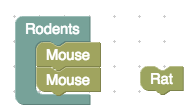

# 类型检查

Blockly完全支持JS和Python之类的动态类型的模型，并且还包括对C / C ++之类的静态类型的模型的支持，但需要做一些额外的工作。

在这两种情况下，Blockly都可以防止构造一些非理性的组合。以下三个模块之间没有业务联系：


Blockly的每种连接类型（值输入/输出，下一个/上一个语句）都可以用类型信息标记，以便显然无效的连接将拒绝连接。这为用户提供了即时反馈，并避免了许多简单的错误。

## 值输入和输出

让我们从一个数字块开始。指定输出时，还可以设置类型字符串。由于此块应该返回一个数字，因此让我们将输出类型设置为字符串'Number'：


```JSON
{
  "type": "math_number",
  // ...
  "output": "Number",
}
```
```js
Blockly.Blocks['math_number'] = {
  init: function() {
    // ...
    this.setOutput(true, 'Number');
  }
};
```


一个更复杂的块是确定数字是否为偶数的数学块。该块具有一个期望输入数字的输入，以及一个返回布尔值的输出。这是指定此代码的代码：

```JSON
{
  "type": "math_number_property",
  // ...
  "args0": [
      // ...
      {
        "type": "input_value",
        "name": "NUMBER_TO_CHECK",
        "check": "Number"
      }
  ],
  "output": "Boolean"
}
```
```js
Blockly.Blocks['math_number_property'] = {
  init: function() {
    // ...
    this.appendValueInput('NUMBER_TO_CHECK').setCheck('Number');
    this.setOutput(true, 'Boolean');
  }
};
```


当数字块连接到该数学块时，两个连接的类型均为'Number'，因此连接成功。而如果有人尝试将文本块（输出类型为'String'）插入数学块，则这两种类型将不匹配，并且连接将拒绝连接。

“ length of”块类似，除了它需要能够接受文本块或列表块。因此，将输入的类型设置为两个选项的数组，而不是一个字符串：

```JSON
{
  "type": "text_length",
  // ...
  "args0": [
      // ...
      {
        "type": "input_value",
        "name": "VALUE",
        "check": ["String", "Array"]
      }
  ],
  "output": "Number"
}
```
```js
Blockly.Blocks['text_length'] = {
  init: function() {
    // ...
    this.appendValueInput('VALUE').setCheck(['String', 'Array']);
    this.setOutput(true, 'Number');
  }
};
```


可以想象，一个块返回两种或多种类型之一。尽管在Blockly中没有当前的示例，但是可以通过将输出类型设置为类型数组来支持。如果输入中的任何单个类型与输出中的类型匹配，则可以连接这些块。

变量是可以保存任何类型的值块的示例。因此，可以将其类型设置为null代表通配符的类型：


```JSON
{
  "type": "variable_get",
  // ...
  "output": null
}
```
```js
Blockly.Blocks['variable_get'] = {
  init: function() {
    // ...
    // Second parameter for type is optional, and null is the default.
    this.setOutput(true);
  }
};
```

这允许将块插入任何输入，而与输入的类型无关。

注意，在Blockly（所使用的类型的字符串'Number'，'Boolean'，'String'， 'Array'，'Colour'）是完全任意的。任何字符串都是可以接受的，并且可以临时发明新的字符串。只要确保输出和输入之间的一致性即可。

## 语句栈

以与输入和输出的水平连接相同的方式，垂直语句堆栈也可以具有类型信息。大多数编码应用程序都不会使用此功能，因为任何语句通常都可以跟随其他任何语句。


在Blockly Developer Tools的Block Factory选项卡中可以看到一种罕见的类型化语句连接示例。请注意，字段块可能不会堆叠在应将输入块放到的位置，输入块可能不会堆叠在应将字段放到的位置。

在三个地方定义了类型化语句：在块的上一个和下一个连接上，以及在语句输入的连接上。这些定义在块的顶部和底部的堆叠槽口，这些槽口只能连接到槽口未类型化或槽口包含至少一种匹配类型的块。

以下示例演示了“鼠标”和“老鼠”类型，其中两种类型的块都可以添加到语句输入RODENTS中。但是，此玩具示例不支持老鼠列表中的老鼠。

JSON格式
的JavaScript
```JSON
{
  "type": "append_mouse",
  "message0": "Mouse",
  "previousStatement": "Mouse",
  "nextStatement": "Mouse"
},

{
  "type": "rodent_list",
  "message0": "Rodents %1",
  "args0": [
      {
        "type": "input_statement",
        "name": "RODENTS",
        "check": ["Mouse", "Rat"]
      }
  ]
}
```
```js
Blockly.Blocks['append_mouse'] = {
  init: function() {
    this.appendDummyInput().appendField('Mouse');
    this.setPreviousStatement(true, 'Mouse');
    this.setNextStatement(true, 'Mouse');
  }
};

Blockly.Blocks['rodent_list'] = {
  init: function() {
    this.appendDummyInput().appendField('Rodents');
    this.appendStatementInput('RODENTS')
        .setCheck(['Mouse', 'Rat']);
  }
};
```

